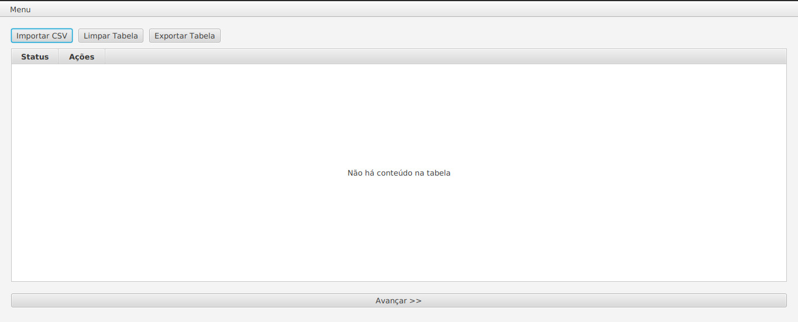
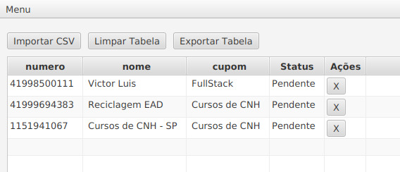
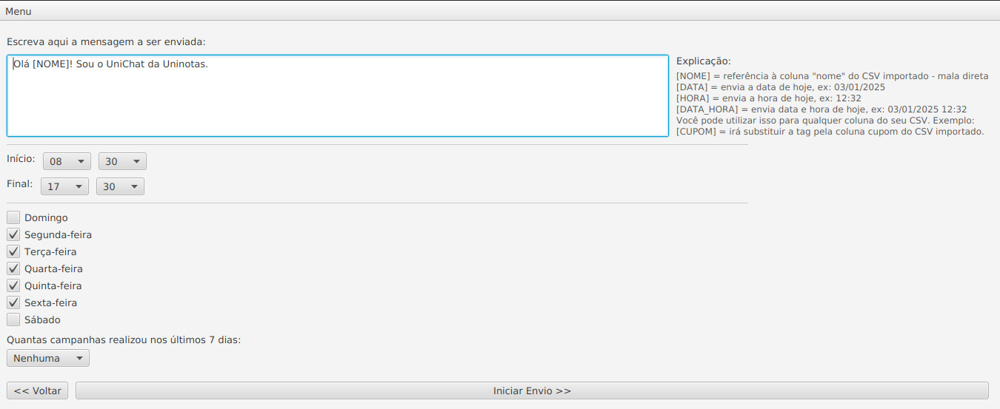
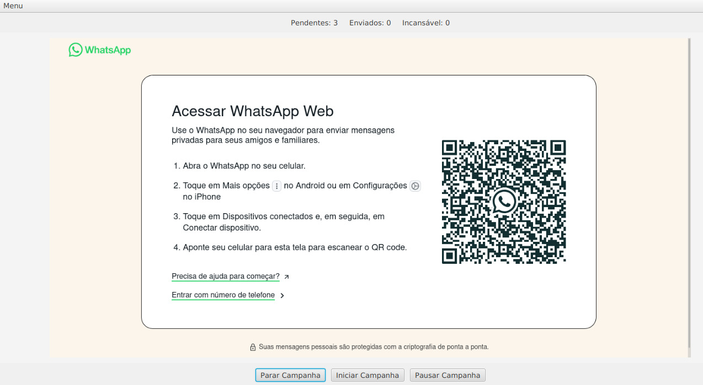

# WhatsApp MKT

Sistema para envio de campanhas de marketing via WhatsApp, com suporte a mensagens em massa (mala direta) para uma lista de contatos extraída de um arquivo `.csv`.

## 📦 Funcionalidades

- Leitura de lista de contatos a partir de arquivo `.csv`
- Geração de mensagens personalizadas por destinatário
- Integração com o WhatsApp Web para envio automático
- Interface simples e prática
- Guia ilustrado com passo a passo

## 🖼️ Ilustrações do uso

Abaixo estão as imagens que ilustram o passo a passo do uso do sistema:

### Passo 1: Inicialização do sistema


### Passo 2: Seleção da lista de contatos


### Passo 3: Geração de mensagens dinâmicas


### Passo 4: Processo de envio via WhatsApp Web


## 🧪 Arquivo de exemplo

Na pasta [`doc/`](./doc), também incluímos um arquivo de exemplo `example.csv`, que contém uma amostra do formato esperado para a lista de contatos.

## 🚀 Como executar

### Requisitos

Antes de rodar o projeto, certifique-se de ter o seguinte instalado:

- **Java 17 ou superior**
- **Maven** (para gerenciar dependências e compilar o projeto)
- **Firefox** (para enviar as mensagens via WhatsApp Web, usando o Selenium)

### Passos para execução:

1. **Clone este repositório**:
   ```bash
   git clone https://github.com/victorluissantos/whatsapp-mkt.git
   ```

2. Entre no diretório do projeto:
	```bash
	cd whatsapp-mkt
	```

3. Compile e gere o JAR executável com Maven:
	```bash
	mvn clean package
	```

4. Execute o projeto:
	```bash
	mvn exec:java
	```

Siga o passo a passo exibido nas imagens para importar sua lista de contatos e enviar as mensagens.